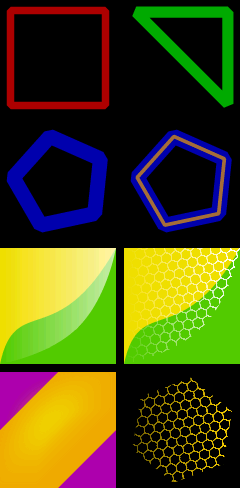

## Overview

PathDrawable is a [Drawable][] that draws simple shapes using [Path][] object.

It uses **extremely** simplified SVG data format used in *&lt;path&gt;* tag for
*d* attribute, see [here][PathData] for more info.
Supported commands are:

*  *M* - move to, interpreted as [Path.moveTo][]
*  *L* - line to, interpreted as [Path.lineTo][]
*  *C* - cubic to, interpreted as [Path.cubicTo][]
*  *z* - close, interpreted as [Path.close][]

You can create PathDrawable object in two ways: in xml file or by API calls.

XML file format is pretty simple: *&lt;layers&gt;* must be the root tag. It must contain one or more *&lt;layer&gt;* tags. 

## Attributes

*&lt;layers&gt;* tag attributes:

*  *path_width* (format="float") - path bounds width (**required**)
*  *path_height* (format="float") - path bounds height (**required**)
*  *android:background* - background drawable, see [android:background attr][BackgroundAttr]

*path_width* and *path_height* define the bounds that will be used for path mapping: it
will be resized with:

    scalex = Drawable width / path_width
    scaley = Drawable height / path_height

*&lt;layer&gt;* tag attributes:

*  *android:tag* (format="string") - layer tag, used with PathDrawable.findLayerByTag(Object) to get the layer
       with given tag
*  *android:gravity* - layer gravity, see [android:gravity attr][GravityAttr]
*  *x_offset* (format="dimension") - layer gravity x offset, used when *android:gravity* specified 
*  *y_offset* (format="dimension") - layer gravity y offset, used when *android:gravity* specified
*  *data* (format="string") - path data (**required**)
*  *stroke_color* (format="color") - stroke color (defaults to #fff)
*  *stroke_width* (format="dimension") - stroke width (defaults to 1)
*  *stroke_style* - path stroke style (defaults to *stroke*), must be one 
       or more (separated by '|') of the following constant values:
  -   *stroke* 
  -   *fill* 
*  *cap_type* - path cap type (defaults to *square*), must be one of 
       the following constant values:
  -   *butt* 
  -   *round* 
  -   *square* 

## Samples

The sample xml file:

	<?xml version="1.0" encoding="utf-8"?>
	<layers xmlns:android="http://schemas.android.com/apk/res/android"
	    xmlns:tools="http://schemas.android.com/apk/res-auto"
	    tools:path_width="32" tools:path_height="32"
	    android:background="#ed0"
	>
	    <layer android:tag="layer0"
		    tools:data="M 32,32 L 32,0 C 15.540043,29.087754 4.2291386,12.026918 0,32 C 5.0306191,31.989233 32,32 32,32 z"
	        tools:stroke_color="#a500c200"
	        tools:stroke_style="fill"
	    />
	    <layer android:tag="layer1"
	        tools:data="M 0,0 L 32,0 C 32,0 29.59354,13.827725 21.59354,21.827725 C 13.59354,29.827725 0,32 0,32 z"
	        tools:stroke_color="#a8c50000"
	        tools:stroke_style="fill"
	   />
	</layers>

Typical usage:

    View view = ...;
    // create a new PathDrawable from res/xml/square.xml
    PathDrawable pd = new PathDrawable(context, R.xml.square);
    view.setBackgroundDrawable(pd);

or:

    View view = ...;
    // create a new PathDrawable 
    PathDrawable pd = new PathDrawable(32, 32);
    String data = "M 2,2 L 30,2 L 30,30 L 2,30 z";
    pd.addLayer(data, 0xff00ff00, 5, Style.STROKE, Cap.ROUND);
    view.setBackgroundDrawable(pd);

Snapshot of some PathDrawables:

Thank you.

[Drawable]:       http://developer.android.com/reference/android/graphics/drawable/Drawable.html
[Path]:           http://developer.android.com/reference/android/graphics/Path.html
[Path.moveTo]:    http://developer.android.com/reference/android/graphics/Path.html#moveTo(float,%20float)
[Path.lineTo]:    http://developer.android.com/reference/android/graphics/Path.html#lineTo(float,%20float)
[Path.cubicTo]:   http://developer.android.com/reference/android/graphics/Path.html#cubicTo(float,%20float,%20float,%20float,%20float,%20float)
[Path.close]:     http://developer.android.com/reference/android/graphics/Path.html#close()
[PathData]:       http://www.w3.org/TR/SVGTiny12/paths.html#PathData
[BackgroundAttr]: http://developer.android.com/reference/android/R.attr.html#background
[GravityAttr]:    http://developer.android.com/reference/android/R.attr.html#gravity
